<div align="center">
<p align="center">
  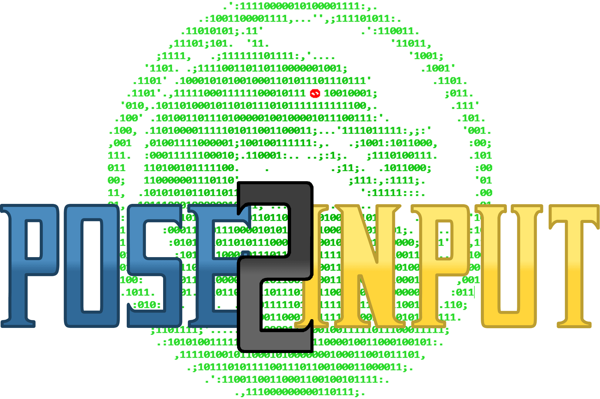
</p>


 <a href="https://github.com/ra101/Pose2Input-MK9/stargazers"></a> <a href="https://github.com/ra101/Pose2Input-MK9/network/members"></a> <a href="https://github.com/ra101/Pose2Input-MK9/issues"></a>  

</div>

Play **Mortal Kombat** with the camera as your input device and your body/pose as a controller.


**Video Tutorial:** [LRBY]() | [YouTube]()

<br>

<br>

## 📈Workflow

It converts given image of pose into keystroke (accorging to the given config). This is done broadly in 4 simple steps:

- **OpenCV** capture image if any motion is detected (via frame differencing)
- **MediaPipe** returns `(x, y)` coordinates of the each body part (if found)
- We use *Mathematics* to determine what pose is and which key that pose is associated with
- **PyAutoGUI** to input the keystroke

<br>

### 📷 Image Processing

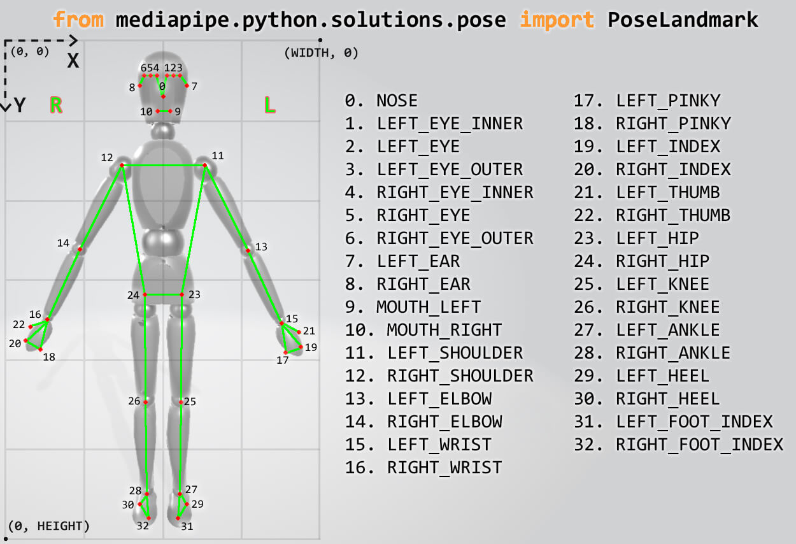

<BR>

### :punch:MoveList

| Move            | Pose Image | Mathematics |
| :-------------: | :--: | :------ |
| **UP**      | 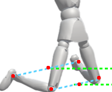 | • *ankles should be above knees* |
| **DOWN**    | 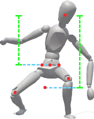  | • *dist(hip->nose) : dist(hip->knee) > **7 : 10*** |
| **LEFT**    | 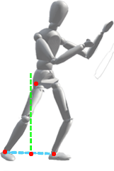  | • *(perpendicular of r_ankle->l_ankle) should be right of **right_hip***<br />• *slope(**right_hip**->ankle) for both ankles should be b/w -65° and -115°* |
| **RIGHT**   | 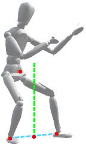  | • *same as above but with **left_hip*** |
| **FRONT_PUNCH** | 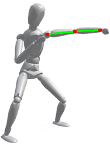 | • *slope(left_shoulder->left_wirst) should be b/w -10.5° and 10.5°*<br />• *angle(left_shoulder<-left_elbow->left_wirst) should be b/w 169.5° and 190.5°*<br /> **TLDR: arm should parallel to ground** |
| **BACK_PUNCH** | 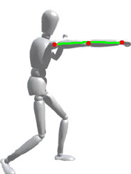 | • *same as above but with **right arm*** |
| **FRONT_KICK** | 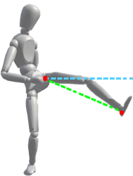  | • *slope(left_ankle->left_hip) should be b/w 45° and 135°* |
| **BACK_KICK** |    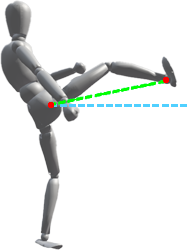   | • *same as above but with **right leg*** |
| **THROW**   |   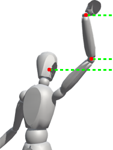    | • *wrist should be above elbow of same arm, they both should be above nose* |
| **TAG**     |    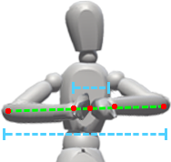  | • *dist(wrists) : dist(elbows) < 3 : 10*<br />• *angle(left_elbow<-wirsts->right_elbow) should be b/w 169.5° and 190.5°*<br />**TLDR: forearms should parallel to ground** |
| **BLOCK**   |   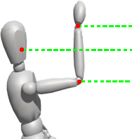   | • *wrist should be above nose, they both should be above elbow of same arm* |

<br>

## ⚙Development

### :floppy_disk:Setup

Lets start the standard procedure for python project setup.

- Clone the repository

```bash
$ git clone https://github.com/ra101/Pose2Input-MK9.git
```

- Create the virtualenv and activate it

```bash
$ cd Pose2Input-MK9
$ virtualenv venv
$ source ./venv/bin/activate # unix
$ .\venv\Scripts\activate.bat  # windows
```

- Install requirements

```bash
$ pip install -r requirements.txt
```

- copy content of .env.template into .env *(one can use [dump-env](https://github.com/sobolevn/dump-env) as well)*

```bash
$ cat .env.template > .env
```


**Env Help Guide:**

| Env Variables             | Defination                                          | Default Value |
| ------------------------------ | ----------------------------------- | ------------- |
| **Pose2Input Variables**:      |                                                     |               |
| CAMERA_PORT                    | Camera Port for OpenCV              | 0             |
| DELAY_TIME                     | A Delay before Starting the Program | 0             |
| LOG_FPS                        | FPS Setting for logs | 20            |
| MOTION_THRESHOLD_FACTOR | More the value is, More the Motion is Captured | 64            |
|  |  |  |
| **PyAutoGUI Constants:** |  |  |
| PYAUTO_PAUSE | Time (sec) to pause after each PyAuto Function Call | 0.1 |
|  |  |  |
| **Input Config:** |  |  |
| UP | KeyStroke for UP (used by PyAuto) | up |
| DOWN | KeyStroke for Down (used by PyAuto) | down |
| `<move>` | KeyStroke for `<move>` (used by PyAuto) | `<key>` |

<br>

### 💻Run

One can simply run the application by this

```bash
$ python run.py
```

but for calibration, optional arguments are provided

| Argument                     | Alias             | Purpose                                                      | Deafult |
| ---------------------------- | ----------------- | ------------------------------------------------------------ | ------- |
| --help                       | --h               | Shows the available options                                  | -       |
| --debug_level   <0, 1, 2, 3> | --d  <0, 1, 2, 3> | Set Different Levels of Information for Logs or Live feed (explained below this table) | `0`     |
| --log_flag                   | --l               | Stores the `video_log` in "logs" folder (.avi)               | `False` |
| --live_flag                  | -L                | Displays the Captured Video                                  | `False` |

**Debug**:

- Levels:
  - **0**: Raw Video Footage
  - **1**: `0` + FPS and Output Moves
  - **2**:  `1` + Virtual Exoskeleton of Body Parts Found
  - **3**:  `2` + Black Screen if no motion found
- If `debug_level` > 0 and no flag is selected, then `log_flag` is automatically set to `True`


**Example of all flags being used**:

```bash
$ python run.py --debug_level 3 --live_flag --log_flag
```

<br><br>

## 📃Breakdown of `requirements.txt`

| Dependency       | Usage                                                        |
| ---------------- | ------------------------------------------------------------ |
| Python-DotENV    | Reads the key-value pair from `.env` file and adds them to environment variable. |
| OpenCV-Python    | Image Processing library which uses NumPy containers|
| MediaPipe        | Offers cross-platform, customizable ML solutions for live and streaming media. |
| PyAutoGUI        | It can control the mouse and keyboard to automate interactions with other applications. |


<br><br>

## 🎁Donations

[](https://www.buymeacoffee.com/ra101)

<br>

## 🌟Credit/Acknowledgment

[](https://github.com/ra101/Pose2Input-MK9/graphs/contributors)

<br>

## 📜License

[](https://github.com/ra101/Pose2Input-MK9/blob/core/LICENSE)

<br>

## 🤙Contact Me

[](mailto://agarwal.parth.101@protonmail.com) [](https://telegram.me/ra_101)
